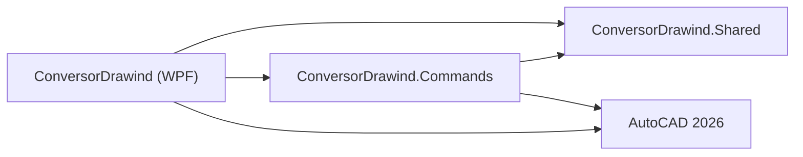

# Arquitetura

Esta solucao separa configuracao, interface/automacao e comandos AutoCAD. A regra geral e: `Shared` conhece dados e persistencia, `WPF` conhece usuario e AutoCAD via COM, `Commands` conhece a API gerenciada do AutoCAD e executa a conversao.

## Projetos

### `ConversorDrawind.Shared`

Projeto de biblioteca em `net8.0-windows`.

Responsabilidades:

- Definir o modelo central `Configuration`.
- Definir modelos de configuracao: geral, cotas, texto, escala, layers, linhas, comandos, blocos, runtime e catalogos.
- Salvar e carregar conversores `.txml`.
- Ler configuracoes antigas e converter para o modelo atual.
- Manter defaults e compatibilidade com nomes/formatos legados.
- Salvar preferencias por usuario, como caminho do `.lin` e ultimo conversor usado.

Arquivos importantes:

- `Models/Configuration.cs`: objeto central usado por WPF e Commands.
- `Configuration/ConverterConfigurationModels.cs`: classes internas da configuracao estruturada.
- `Configuration/ConverterConfigurationXml.cs`: leitura e escrita de `.txml`, incluindo contrato `VERSION="2"` e fallback legado.
- `Configuration/ConfigurationLegacyCompatibility.cs`: camada de compatibilidade para consumidores antigos.
- `Configuration/UserSettingsService.cs`: preferencias por usuario em `%LocalAppData%\ConversorDrawind`.
- `Configuration/AtomicFile.cs`: escrita atomica para reduzir risco de arquivo parcial.

### `ConversorDrawind`

Aplicativo WPF em `net8.0-windows`, `x64`.

Responsabilidades:

- Exibir a tela principal de configuracao.
- Editar conversores, regras, blocos, estilos, layers, escala e comandos Lisp/DLL.
- Salvar e carregar conversores por meio de `Shared`.
- Rodar a conversao em lote.
- Abrir o AutoCAD via COM.
- Carregar a DLL de comandos no AutoCAD.
- Enviar comandos para o AutoCAD e aguardar conclusao.
- Controlar progresso, cancelamento e dialogs de resultado.

Pastas importantes:

- `UI/Wpf/Main`: janela principal e tabs do editor/conversor.
- `UI/Wpf/*`: dialogs e controles WPF novos.
- `UI/Adapters/*`: adaptadores de compatibilidade com nomes/fluxos legados.
- `Conversion`: orquestracao da execucao em lote e comunicacao com AutoCAD.
- `Infrastructure/AutoCAD`: COM retry, message filter, ativacao de janela e utilitarios AutoCAD.
- `Runtime`: estado global de runtime ainda usado por fluxos legados.

Classes importantes:

- `DrawingProcess`: fachada estatica do processo de conversao.
- `DrawingProcess.Batch`: fluxo de lote, progresso, log e falhas.
- `DrawingConversionWorkflow`: execucao de um desenho individual.
- `AutoCadSession`: estado da sessao COM AutoCAD.
- `DrawingCommandBuilder`: montagem de comandos enviados para o AutoCAD.
- `ConversionPreflightValidator`: validacoes antes de iniciar o lote.

### `ConversorDrawind.Commands`

Biblioteca `net8.0-windows`, `x64`, carregada dentro do AutoCAD.

Responsabilidades:

- Expor comandos AutoCAD via `[CommandMethod]`.
- Carregar a configuracao temporaria gravada pelo WPF.
- Executar a conversao funcional do desenho.
- Criar layers, estilos de texto, cotas, blocos e atributos.
- Converter layers, remover layers/blocos, aplicar escala, explodir entidades e finalizar/purgar.
- Registrar logs e mensagens de conversao.

Pastas importantes:

- `Commands`: pontos de entrada `CDwi_*` e servicos de comando.
- `Workflows`: orquestradores e contexto de execucao.
- `Services/Blocks`: conversao de blocos, atributos e bloco DM.
- `Services/Dimensions`: conversao e ajuste de cotas.
- `Services/Layers`: criacao, selecao, filtros, conversao e limpeza de layers.
- `Services/Scale`: deteccao e aplicacao de escala.
- `Services/Styles`: operacoes de estilos.
- `Services/Text`: estilos/texto.
- `Services/LineType`: carregamento de linetypes.
- `Services/Utility`: zoom, purge e explode.
- `AutoCAD`: wrappers/adaptadores para document, editor, selecao e variaveis de sistema.

## Dependencias entre projetos

Observacoes:

- `Shared` nao deve depender de WPF nem da API AutoCAD.
- `Commands` deve conter a logica funcional que precisa rodar dentro do AutoCAD.
- `WPF` pode referenciar `Commands` porque precisa localizar/carregar a DLL e compartilhar alguns tipos, mas a execucao real dos comandos acontece no processo do AutoCAD.

## Fronteiras de responsabilidade

Use esta regra ao decidir onde colocar codigo novo:

| Necessidade | Projeto correto |
| --- | --- |
| Novo campo de configuracao | `ConversorDrawind.Shared` |
| Novo controle/tela/dialog de configuracao | `ConversorDrawind` |
| Nova validacao antes de executar lote | `ConversorDrawind` |
| Novo comando AutoCAD | `ConversorDrawind.Commands` |
| Nova regra que altera entidades no desenho | `ConversorDrawind.Commands` |
| Novo formato de persistencia `.txml` | `ConversorDrawind.Shared` |
| Novo teste de funcao pura ou workflow de comando | `ConversorDrawind.Commands.Tests` |

## Estado e compatibilidade

O modelo atual e `Configuration`. A classe `ConverterConfiguration` ainda existe apenas como alias de compatibilidade e esta marcada como obsoleta.

`Configuration.Config` ainda funciona como ponto global de compatibilidade, especialmente nas bordas de comandos e carregamento legado. Em codigo novo, prefira receber `Configuration` como dependencia explicita quando possivel.

## Decisoes relevantes da refatoracao

- `.txml` novo usa XML estruturado com `VERSION="2"`.
- `.txml` antigo ainda e lido por `LegacyConfigurationXmlReader`.
- Escrita de `.txml` e preferencias usa escrita atomica.
- Preferencias por usuario migraram para `%LocalAppData%\ConversorDrawind`.
- O processo em lote diferencia sucesso/falha por desenho.
- A sessao COM do AutoCAD concentra documentos, eventos e liberacao de referencias.
- A conversao no AutoCAD e dividida em workflows e servicos menores.
