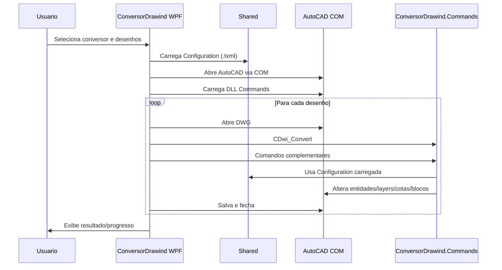

# Execucao da conversao

A execucao e dividida em duas partes: o aplicativo WPF controla o lote e o AutoCAD; a DLL `ConversorDrawind.Commands` executa as alteracoes dentro do desenho.

## Fluxo de alto nivel

## Lado WPF

O ponto historico de entrada e `DrawingProcess.GoProcess(object parameter)`.

`parameter` deve ser um `Param1` contendo:

- `configuration`: configuracao carregada.
- `desenhosName`: arquivos a converter.
- `closedesenhos`: flag que controla fechamento de desenhos.
- demais opcoes usadas pelo fluxo legado.

Etapas principais em `DrawingProcess.Batch`:

1. Prepara o log de arquivos convertidos.
2. Valida parametros basicos.
3. Escreve o caminho temporario do `.txml` em `DrawingProcessPaths.TempCommandFile`.
4. Abre o AutoCAD via COM.
5. Carrega a DLL de comandos.
6. Processa cada desenho.
7. Atualiza progresso (`Valor`, `Index`, `FileOpen`).
8. Registra arquivos convertidos com sucesso.
9. Guarda falhas para aviso final.
10. Fecha/libera a sessao AutoCAD.

## Sessao AutoCAD COM

`DrawingProcess` cria a aplicacao AutoCAD usando ProgIDs:

- `AutoCAD.Application.25.1`
- `AutoCAD.Application.25`
- `AutoCAD.Application`

`AutoCadSession` guarda:

- Aplicacao AutoCAD.
- Documento atual.
- Documento de atributos/formato, quando usado.
- Lista de documentos abertos pelo conversor.

`MessageFilter.ScopedRegistration()` e usado para reduzir falhas COM de chamada rejeitada.

`ComRetry` encapsula tentativas em chamadas COM sensiveis.

Ao fechar, o codigo:

- Desassina eventos `BeginCommand` e `EndCommand`.
- Fecha documentos controlados pelo conversor quando aplicavel.
- Libera referencias COM com `Marshal.FinalReleaseComObject`.
- Reseta estado da sessao.

## Execucao de um desenho

`DrawingConversionWorkflow.Execute(file, isLastDrawing)` executa um arquivo individual.

Sequencia principal:

1. Verifica se o arquivo existe.
2. Cria backup `.bak`.
3. Abre o desenho no AutoCAD.
4. Envia `ZOOM E`.
5. Envia `CDwi_Convert`.
6. Se `ExchangeFormat` estiver ativo, copia formato/blocos do desenho de atributos.
7. Se `ConvertLayers` estiver ativo, envia `CDwi_DeleteLayers`.
8. Se `ApplyDrawingScale` estiver ativo, envia `CDwi_Scale`.
9. Executa comandos Lisp configurados.
10. Envia `CDwi_Finalize`.
11. Aplica `ZoomExtents`.
12. Salva como DWG ou DXF.
13. Fecha o desenho quando configurado.

Quando uma etapa critica falha, o desenho nao e registrado como convertido.

## Comandos AutoCAD

Comandos expostos por `ConversorDrawind.Commands`:

| Comando | Papel |
| --- | --- |
| `CDwi_Convert` | Orquestra a conversao principal do desenho. |
| `CDwi_DeleteLayers` | Remove layers conforme configuracao. |
| `CDwi_LoadLayer` | Carrega/cria layers configuradas. |
| `CDwi_NewLayer` | Cria nova layer. |
| `CDwi_LoadLineType` | Carrega linetypes. |
| `CDwi_Scale` | Aplica escala do desenho. |
| `CDwi_ScaleBlock` | Ajusta escala de bloco colado. |
| `CDwi_GetBlocks` | Exporta/lista blocos do desenho para fluxo WPF. |
| `CDwi_GetAttributeText` | Captura texto/atributos usados na troca de formato. |
| `CDwi_AttributeBlock` | Atualiza atributos de bloco. |
| `CDwi_DeleteBlocks` | Remove blocos conforme fluxo configurado. |
| `CDwi_Finalize` | Finaliza conversao, purge e ajustes finais. |
| `CDwi_Save` | Salva pelo comando do AutoCAD. |
| `SaveDXF` | Salva em DXF quando extensao geral nao e DWG. |
| `CDwi_GetPoint` | Captura ponto. |
| `CDwi_Get2Point` | Captura dois pontos. |
| `CDwi_GetDistHorizontal` | Mede distancia horizontal. |
| `CDwi_GetDistVertical` | Mede distancia vertical. |
| `CDwi_GetLayer` | Captura layer. |
| `CDwi_TextHeight` | Captura altura de texto. |

## `CDwi_Convert`

`CDwi_Convert` e o comando principal. Ele:

1. Reseta `ConversionSession`.
2. Cria contexto de documento/editor/selecao.
3. Cria `ConversionCommandRunner`, `ScaleWorkflow` e `ConversionStepRunner`.
4. Escreve banner inicial no editor do AutoCAD.
5. Converte layers iniciais de blocos.
6. Calcula extents e move desenho para origem.
7. Inicializa logger.
8. Carrega configuracao temporaria.
9. Captura escala, se possivel.
10. Define `DWGCHECK`.
11. Executa `ConversionWorkflow`.

`ConversionWorkflow` decide as etapas pela configuracao:

- `CreateLayersIfEnabled`
- `CreateTextStylesIfNeeded`
- `ConvertDimensionsIfEnabled`
- `RunTeklaInverseConversionIfNeeded`
- `ExplodeBlocksIfConfigured`
- `AddDmBlockIfEnabled`
- `DeleteTeklaStructuresIfEnabled`
- `ConvertLayersIfEnabled`

## Logs e progresso

O WPF usa:

- `ApplicationRuntime.LOGdirConvertidos`
- `ApplicationRuntime.LOGarqConvertidos`
- `DrawingProcess.Valor`
- `DrawingProcess.Index`
- `DrawingProcess.FileOpen`

Os comandos usam:

- `ConversionLogger`
- `ConversionLog`
- `ConversionMessages`
- `ConversionSession`

## Comandos Lisp e DLL configurados

`CommandConfiguration` possui:

- `LispCommands`
- `DllCommands`

Os comandos Lisp sao interpretados por `LispCommandDefinition`. O workflow diferencia comandos comuns de comandos que rodam apenas apos a conversao do ultimo desenho.

Durante execucao de Lisp, `FILEDIA` e ajustado para `0` e restaurado para `1`.

## Cuidados ao alterar o fluxo

- Alteracoes que dependem da API AutoCAD devem ficar em `ConversorDrawind.Commands`.
- Alteracoes de automacao COM e lote devem ficar em `ConversorDrawind`.
- Nao salve um desenho se a etapa principal falhou.
- Evite adicionar novo estado global; prefira contexto ou dependencia explicita.
- Ao adicionar comando `CDwi_*`, inclua teste quando a parte central puder ser isolada da API AutoCAD.
